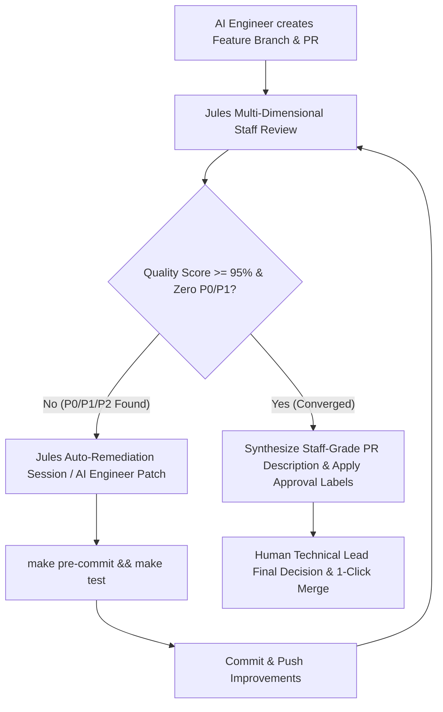

# Jules Autonomous AI Engineering Review & Improvement Loop

This skill establishes the standard operating framework for the autonomous AI-driven engineering pipeline across repositories. Under this framework, concurrent AI engineers author implementations and open Pull Requests, while **Google Jules CLI** performs multi-dimensional code reviews and autonomous remediation cycles until the PR achieves production convergence—requiring only final high-level signoff from the human **Technical Lead**.

---

## 1. Pipeline Architecture & Tech Lead Delegation Model



### Roles & Responsibilities
- **AI Engineers**: Implement feature tasks, write comprehensive unit/integration test suites, update corresponding agent skills and documentation, and open Pull Requests targeting `main`.
- **Jules Review Engine**: Evaluates PRs across 38 dimensions with the rigor of a Principal Staff Engineer, posts transparent audit comments to GitHub threads, and triggers automated remediation loops.
- **Human Technical Lead**: Validates high-level product direction, evaluates non-obvious engineering tradeoffs, and provides final merge authorization. All mechanical, stylistic, performance, and maintainability concerns are guaranteed to be resolved before the Tech Lead reviews.

---

## 2. The 38 Principal Staff Review Dimensions

Every review rigorously grades the implementation across these 38 engineering facets:

| # | Dimension | Principal Staff Audit Criteria |
| :-: | :--- | :--- |
| **1** | **Correctness** | Logic integrity, edge-case coverage, and zero regression guarantee |
| **2** | **Architecture** | Adherence to defined system boundaries and service decoupling |
| **3** | **System Design** | Microservice decoupling, single-responsibility, and scalable service interfaces |
| **4** | **Scalability** | Horizontal scaling capability, stateless handlers, and connection pool sizing |
| **5** | **Performance** | Sub-millisecond database queries, non-blocking I/O, minimal bundle size |
| **6** | **Time/Space Complexity** | Algorithmic efficiency: $O(1)$ / $O(\log N)$ lookups, zero unbounded $O(N^2)$ loops |
| **7** | **Concurrency Safety** | Safe mutex locking, zero data races, connection pool thread safety |
| **8** | **Distributed Systems** | Idempotency keys, exponential backoff with jitter, partition resilience |
| **9** | **API Design** | RESTful HTTP semantics, typed JSON envelopes, real-time WebSocket protocol |
| **10** | **Maintainability** | Clean code, low cyclomatic complexity, clear domain naming |
| **11** | **Readability** | Idiomatic Go, Python, and TypeScript; self-documenting code |
| **12** | **Extensibility** | Pluggable storage providers and modular registry architectures |
| **13** | **Modularity** | Clean module boundaries, zero circular package dependencies |
| **14** | **Error Handling** | Structured error envelopes, typed error codes, zero unhandled panics |
| **15** | **Security** | Zero raw credentials/secrets, encrypted vaults, SSL connections |
| **16** | **Reliability** | Automatic multi-key failover, backoff retry policies |
| **17** | **Observability** | Real-time event broadcasting, structured streaming traces, telemetry |
| **18** | **Logging** | Structured JSON logs with ISO timestamps, log levels, request_id correlation |
| **19** | **Metrics** | Duration histograms, throughput gauges, error counters |
| **20** | **Tracing** | Distributed `request_id` correlation across services |
| **21** | **Testing Quality** | Unit, integration, mock server, and AI agent multi-turn test suites |
| **22** | **Edge Cases** | Empty payloads, network timeouts, upstream rate limits, concurrent writes |
| **23** | **Failure Recovery** | Automatic database reconnection, graceful service degradation |
| **24** | **Documentation** | Autonomous synchronization of `docs/`, `README.md`, `CHANGELOG.md`, `.agents/skills/` |
| **25** | **Code Duplication** | DRY compliance, centralized configuration extractors |
| **26** | **Dependencies** | Minimal footprint, frozen lockfiles (`pnpm-lock.yaml`, `uv.lock`) |
| **27** | **Resource Usage** | Zero open file descriptor leaks, bounded buffer allocations |
| **28** | **Memory Efficiency** | Streaming response readers, zero heap memory accumulation |
| **29** | **CPU Efficiency** | Vectorized computations, pre-compiled regular expressions |
| **30** | **I/O Efficiency** | Asynchronous disk/network writes, buffered file flushes |
| **31** | **Database Efficiency** | Indexed SQL queries, pgvector cosine search, zero full table scans |
| **32** | **Network Efficiency** | HTTP/2 keep-alive, compressed JSON payloads, batched requests |
| **33** | **CI/CD Compatibility**| Clean multi-stage build workflows, dynamic secrets |
| **34** | **Production Readiness**| Healthcheck endpoints (`/health`), live probes, zero debug flags |
| **35** | **Backward Compatibility**| Idempotent DDL migrations (`IF NOT EXISTS`, no `DROP`/`TRUNCATE`) |
| **36** | **Coding Standards** | 0 Biome lint errors, `gofmt` formatted, 0 Pyright type errors |
| **37** | **Repository Conventions**| Canonical branch naming `<user>/<base>/<feature>`, signed commits (`-s -S`) |
| **38** | **Project-Specific Rules**| Architectural guardrails, failover pools, HITL confirmation |

---

## 3. Acceptance Criteria for Automatic Approval

A Pull Request is declared **Converged** and automatically approved by Jules when:
1. **Quality Score >= 95/100**: Evaluated across all 38 dimensions.
2. **Zero P0 Blockers**: No correctness bugs, security vulnerabilities, destructive schema drops, or secret leaks.
3. **Zero P1 Architectural Violations**: Strict adherence to deployment boundaries and centralized config extractors.
4. **100% Test Suite Pass**: All unit, integration, and shell test suites pass.
5. **Zero Lint & Type Errors**: Linters and type checkers pass cleanly.
6. **Autonomous Doc & Skill Sync Verified**: All affected documentation and agent skills are updated.

---

## 4. Jules CLI Developer Commands & Operations

```bash
# 1. Trigger Jules review loop locally on a PR
./scripts/jules-review-loop.sh --pr <pr-number>

# 2. Preview review evaluation without making changes
./scripts/jules-review-loop.sh --pr <pr-number> --dry-run

# 3. Create a remote Jules remediation session
jules new --repo <owner>/<repo> "Refactor database query to avoid N+1 scans"

# 4. List active remote Jules sessions
jules remote list --session

# 5. Pull and apply session patch to local repository
jules remote pull --session <session-id> --apply
```

---

## 5. GitHub Actions Integration — How Jules Is Triggered in Practice

> [!IMPORTANT]
> **The GitHub Actions workflow is the primary runtime trigger for Jules.** The CLI commands above (Section 4) are for local/manual invocation. In standard repository workflow, Jules is triggered automatically on every Pull Request via a GitHub Actions workflow that assigns `@google-labs-jules[bot]` as a reviewer.

### How the Trigger Works

1. A developer or AI agent opens a PR targeting `main`.
2. The `jules-pr-review.yml` GitHub Actions workflow fires automatically.
3. The workflow calls the GitHub API to assign `@google-labs-jules[bot]` as a reviewer.
4. Jules detects the reviewer assignment, clones the PR branch, and runs its 38-dimension review pipeline.
5. Jules posts a structured review comment on the PR thread with scores, findings, and suggested fixes.
6. If P0/P1 issues are found, Jules opens a remediation session and iterates until the PR converges.

### Required Workflow: `.github/workflows/jules-pr-review.yml`

Every repository MUST have this workflow deployed:

```yaml
# .github/workflows/jules-pr-review.yml
name: "PR Opened — Assign Jules AI Reviewer"

on:
  pull_request:
    types: [opened, synchronize, reopened]
    branches:
      - main

permissions:
  pull-requests: write

jobs:
  assign-jules-reviewer:
    name: "Assign Jules Bot as PR Reviewer"
    if: github.event.pull_request.draft == false
    runs-on: ubuntu-latest
    steps:
      - name: "Request Jules Review"
        uses: actions/github-script@v7
        with:
          github-token: ${{ secrets.GITHUB_TOKEN }}
          script: |
            const prNumber = context.payload.pull_request.number;
            const eventAction = context.payload.action;
            if (eventAction === 'synchronize') {
              core.info('New commits pushed — Jules will auto re-review. Skipping re-assignment.');
              return;
            }
            try {
              await github.rest.pulls.requestReviewers({
                owner: context.repo.owner,
                repo: context.repo.repo,
                pull_number: prNumber,
                reviewers: ['google-labs-jules[bot]']
              });
              core.info(`✅ Jules assigned as reviewer for PR #${prNumber}.`);
            } catch (error) {
              core.warning(`⚠️  Could not assign Jules reviewer: ${error.message}`);
              core.warning('Ensure the Jules GitHub App is installed: https://jules.google.com');
            }
```

### Prerequisite: Jules GitHub App Installation

> [!IMPORTANT]
> The Jules GitHub App **must be installed** in your GitHub organization or repository before this workflow can trigger Jules reviews.
> - Install at: **[jules.google.com](https://jules.google.com)** → "Install Jules on GitHub"
> - Grant access to the target repository (e.g., `Career-Cafe/dsa-confidence-engine`)
> - Once installed, `@google-labs-jules[bot]` becomes a valid reviewer in the org

### Draft PR Behavior
- **Draft PRs**: Jules is NOT assigned — the workflow skips `draft == true` PRs.
- **Ready for Review**: When a draft is converted to ready, Jules is assigned automatically (via the `reopened` trigger).
- **New commits (synchronize)**: Jules automatically re-reviews without a new assignment.

